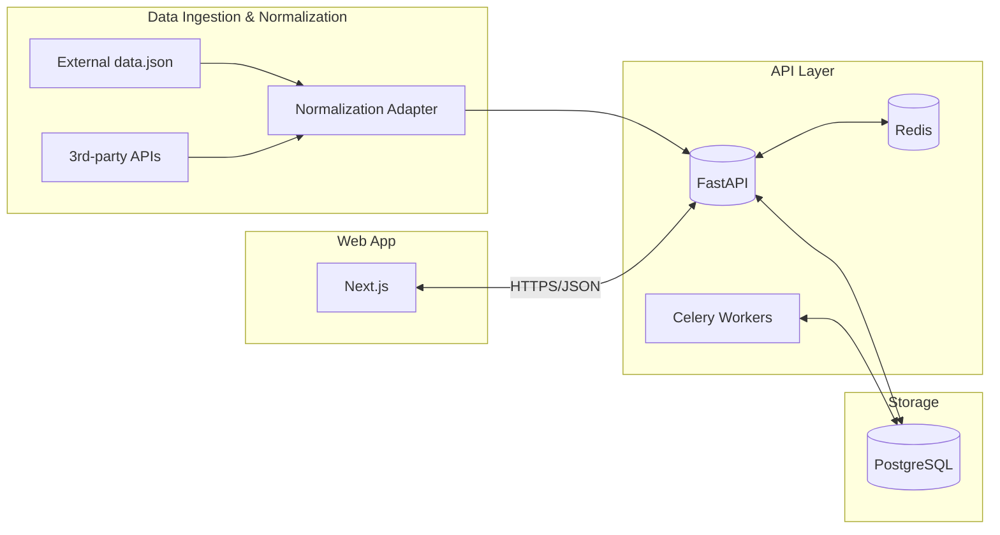

# System Architecture

## 아키텍처 개요
외부 고객용 웹 대시보드 제품. 신뢰도 높은 메트릭과 스프린트 정보를 제공하며, 품질/안정성을 최우선으로 한다. 수집/정규화 계층에서 데이터를 받아 API 계층을 통해 프론트로 전달한다. 인증/권한은 역할 기반으로 최소권한 원칙을 따른다.

## 기술 스택
- **Frontend**: Next.js 14 (App Router), React, TypeScript, Tailwind CSS
- **Backend**: FastAPI (Python) + Uvicorn, Pydantic, Celery(배치/비동기 작업)
- **Database**: PostgreSQL (주 데이터), Redis (캐시/큐)
- **Infrastructure**: Vercel(프런트), Fly.io/Render(백엔드), Supabase/RDS(Postgres), Cloudflare CDN, Sentry/Otel(관측)

## 시스템 구성도

## API 설계
- 버전: `/api/v1`
- 공통 응답: `{ "success": true|false, "data": any, "error": {code, message, details?} }`
- 인증: Bearer JWT(OAuth2 Password/PKCE), 쿠키 SameSite=Lax 옵션

### Metrics
- GET `/api/v1/metrics`  메트릭 스냅샷 목록/요약
- GET `/api/v1/metrics/:id`  상세 조회

### Sprint
- GET `/api/v1/sprint/current`  현재 스프린트 요약
- GET `/api/v1/sprint/:id`  스프린트 상세(이슈/진척 포함)

### Dashboard Config
- GET `/api/v1/dashboard`  위젯/레이아웃 구성
- PUT `/api/v1/dashboard`  사용자별 구성 저장(옵션)

## 데이터베이스 설계
- `users(id, email, name, role, password_hash, created_at)`
- `sessions(id, user_id, created_at, expires_at)`
- `metrics(id, key, label, unit, created_at)`
- `metric_snapshots(id, metric_id, value, captured_at, source)`
- `sprints(id, name, start_date, end_date, goal, status)`
- `sprint_items(id, sprint_id, title, type, status, points, assignee)`
- `dashboard_configs(id, user_id, layout_json, widgets_json, updated_at)`

인덱스: `metric_snapshots(metric_id, captured_at)`, `sprint_items(sprint_id, status)`, `users(email unique)`

## 보안 고려사항
- 최소권한(Role: viewer/editor/admin), 민감 정보 암호화(비밀번호 해시: Argon2/bcrypt)
- 입력 검증(Pydantic), 레이트 리밋(토큰/아이피), 감사 로그(접근/변경)
- HTTPS 전제, CORS 허용 도메인 화이트리스트, 비밀키/자격증명은 환경변수/비밀관리

## 확장성 계획
- API/워커 무상태 스케일아웃(HPA), 캐시 계층으로 DB 부하 완화
- 읽기-쓰기 분리(리드 리플리카), 장기 이력은 파티셔닝/아카이빙
- 백필/배치 작업은 워커 큐로 분리, 관측(Otel) 기반 병목 개선 루프 운영
